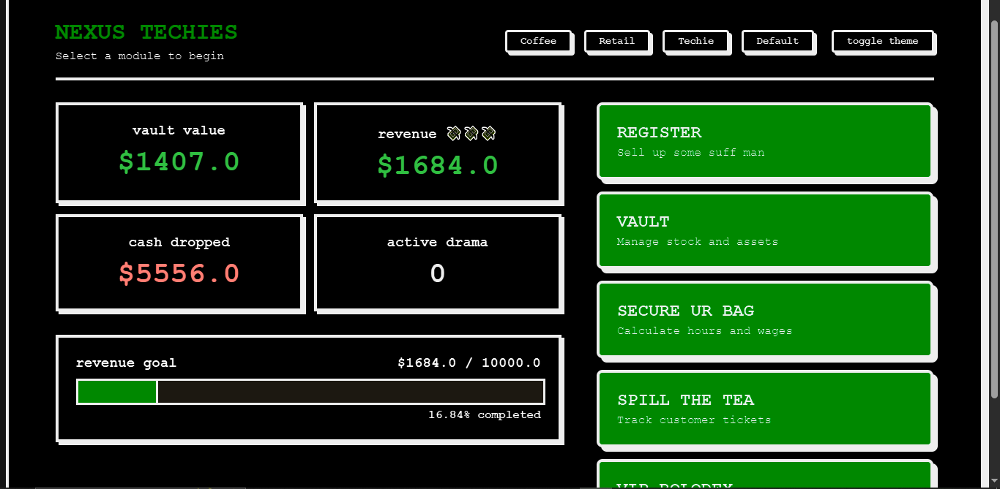
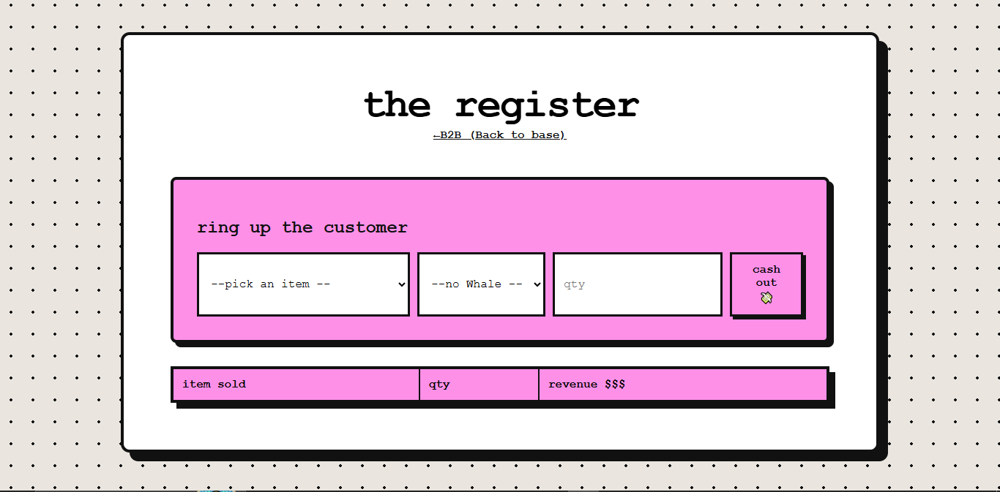
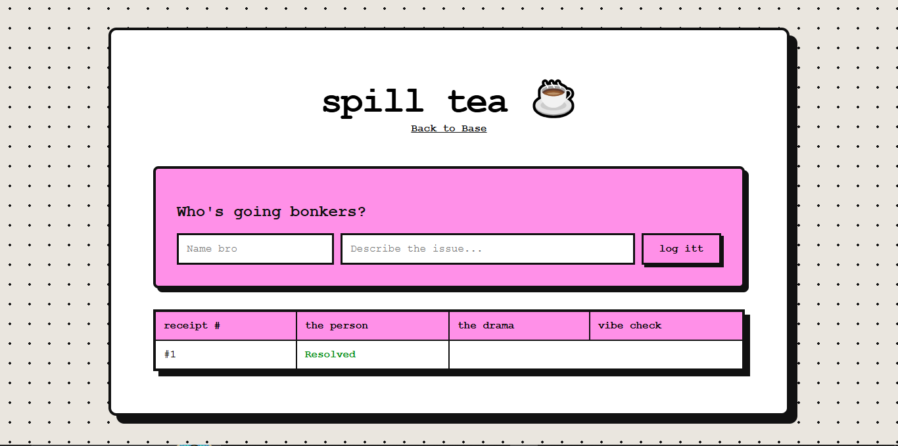

# Mini Business Manager

I looked at some business managing apps and ERP software and they were quite boring to look at, (unless you've got some crazy zeros flashing on the dashboard). So giving it a twist and vibe is mandatory, for which I built this, inspired by my polka dot dress; this small business suite has personality. Without any fees or corporate bloat ofc.
So it's a one-place dashboard for someone running a small business, like a local cafe, retail shop, or a freelance setup. inventory, sales, payroll, and customer management all in one spot. data lives locally for now. 

Try it here - https://sm-business-manager-production-5532.up.railway.app/

## Vibe

for graphic style I went with neobrutalism cuz it looks cool. Thick black borders, shadows, bright colors and comic-book type. Specially the splash-screen ceiling that drops from the above when u enter, my favorite.

## all the modules

VAULT - inventory management. You can add items, trach stock, adjust quantities with the +/- buttons. It also shows in red if your inventory is below 5.

REGISTER - your sales area. can pick and item from dropdown and cash out. It's getting tracked live and gets added to the dashboard.

SECURE UR BAG - payroll, how much to pay each employee, also has a printable receipt feature.

SPILL THE TEA - crm basically, can log customer complaints as tickets and mark them resolved when dealt with. all the gossip is here, lol.

VIP ROLODEX - track ur highest paying customers(whales)

## themes

I just had this itch that it should be having personalized sections acc to the themes, which is future work, for now themes is just switched colors- coffee shop, retail or techies.

Dashboard  has a live revenue tracker with a progress bar for $10k goal.

## how its built

- py / flask for backend
- html / css
- json for storgae, saves everything locally.
- css animations for the splash screen

## ai usage

helped in debugging, splash screen css animation, vercel setup(did not work out) and figure out json save/load pattern.

## contribute

You can clone the repo, install python, then:

pip install -r requirements.txt

python app.py

it runs on localhost:5000 by default. fork it, mess around, send a pull request if you fix something or did something cool.

## license

MIT
